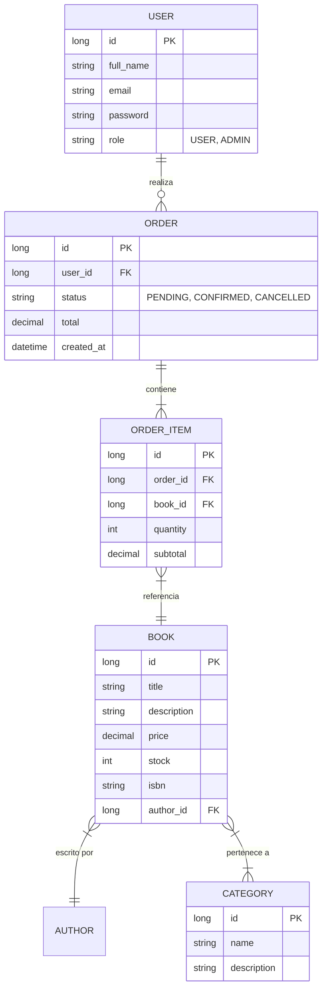

# Bookstore API

API REST para una librería en línea construida con **Spring Boot 3**, **Spring Security (JWT)**, **Spring Data JPA** y **H2/PostgreSQL**.

---

## Modelo de Datos (Diagrama ER)



---

## Tecnologías y Requisitos

- **Java 17** (JDK recomendado)
- **Gradle** (Wrapper incluido)
- **Spring Boot 3.2.x**
- **JWT** para autenticación segura
- **H2 Database** (Memoria para desarrollo)
- **PostgreSQL** (Configurado para producción)
- **Lombok** y **MapStruct**

---

## Configuración y Ejecución Local

### 1. Clonar el repositorio
```bash
git clone <url-del-repositorio>
cd talleramadoymejia22deabaril
```

### 2. Configuración de Variables (Opcional en dev)
El proyecto usa valores por defecto para desarrollo, pero puedes personalizarlos:
- `JWT_SECRET`: Llave para firmar tokens (Base64).
- `DB_URL`, `DB_USERNAME`, `DB_PASSWORD`: Credenciales de base de datos.

### 3. Ejecución con Gradle
```powershell
# Windows
.\gradlew.bat bootRun

# Linux/Mac
./gradlew bootRun
```

La aplicación estará disponible en: `http://localhost:8080/api/v1`

---

## Autenticación y Roles

El sistema maneja dos roles principales:

| Rol | Permisos |
| :--- | :--- |
| `ADMIN` | Gestión total de catálogo (Autores, Libros, Categorías) y gestión de pedidos. |
| `USER` | Consulta de catálogo, gestión de pedidos propios. |

### Credenciales de Prueba (Perfil Dev)
- **Admin**: `admin@bookstore.com` / `Admin1234`
- **User**: `user@bookstore.com` / `User12345`

---

## Documentación de la API

- **Swagger UI**: [http://localhost:8080/api/v1/swagger-ui.html](http://localhost:8080/api/v1/swagger-ui.html)
- **H2 Console**: [http://localhost:8080/api/v1/h2-console](http://localhost:8080/api/v1/h2-console) (JDBC URL: `jdbc:h2:mem:bookstoredb`)

### Colección de Postman
Importa el archivo ubicado en: `postman/bookstore-api.postman_collection.json`

---

## Estructura del Proyecto

```text
src/main/java/com/taller/bookstore
├── controller  # Endpoints REST
├── service     # Lógica de negocio (Interfaces)
├── impl        # Implementación de servicios
├── entity      # Modelos de JPA
├── dto         # Objetos de transferencia de datos (Request/Response)
├── repository  # Interfaces de Spring Data JPA
├── mapper      # Mapeo de Entidades <-> DTOs
├── security    # Configuración de JWT y Spring Security
└── exception   # Manejo global de errores
```

