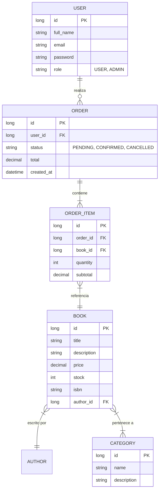

# Diagrama Entidad-Relación (ER) - Bookstore API

Este diagrama representa la estructura de la base de datos y las relaciones entre las entidades del sistema.

## Descripción de Relaciones

1.  **User -> Order**: Un usuario puede realizar múltiples pedidos (1:N).
2.  **Order -> OrderItem**: Un pedido se compone de una o más líneas de detalle (1:N).
3.  **OrderItem -> Book**: Cada ítem del pedido referencia a un libro específico (N:1).
4.  **Book -> Author**: Un libro es escrito por un único autor (N:1).
5.  **Book <-> Category**: Un libro puede pertenecer a varias categorías y una categoría puede tener varios libros (M:N). En la implementación JPA, esto se maneja mediante una tabla intermedia `book_categories`.
